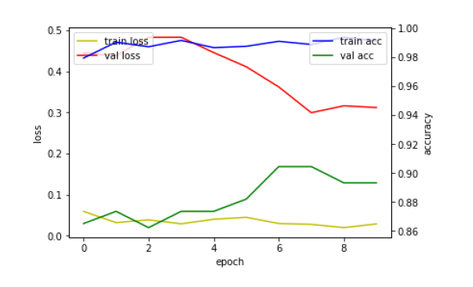

# House-Interior-Classifier-and-Automatic-Recommendation
2022 spring deep learning class project. It categorizes the house interior and searches automatically.  

## Environment
0. windows 
1. python = 3.8
2. CUDA = 11.3
3. cuDNN = 8.2.1
4. selenium = 4.2.0 for automatic searching

## Training
Training :  **Inception ResNet V2**. 

## Dataset
The data set was labeled using [AirBnB Duplicate Image Dataset](https://www.kaggle.com/datasets/barelydedicated/airbnb-duplicate-image-detection). The format is the `.npy` file type.

## Classification
I created two learning models. 
One is the **Style model**, which classify four types of styles, the other is the **Factor model**, and classify three detailed factors. These two models are **independent** of each other.

## Excute
If you want to know learning process, please refer to the `House_Interior_Classifier.ipynb` file.  
The application implemented through the actual learned model can run the file `Excuter.py`. It performs an automatic search after classification.(But I did not upload the learned model.)

## Result
### Style

### Factor

## Significance
### Abstract
when users provide house interior photos, they are classified as Style and Factor accordingly based on CNN. Search words can be recommended according to the user's desired furniture and classification results. 
We can pursue an application that recommends furniture only by providing pictures without having to search for the furniture they want for a long time, and this report provides a function to recommend search words and automatically search. 
In particular, due to the characteristic of the house interior, the producer's subjectivity may be included when collecting and labeling data, so clear standards are set and datasets are produced.

### Conclusion
Learning, dataset production, and actual classification were all successfully implemented, and they could be evaluated numerically. 
We also implemented the function of presenting search terms and automatically searching. Because it is the meaning of the technology that does not end in learning and actually allows users to use this technology conveniently. 
However, since the dataset was produced by itself, it is highly likely that the subjectivity of the creator was included in the interior classification, and clear standards should be established and used carefully. However, if the system develops in the future, there is an expectation that the more diverse data sets are collected, even if it is a subjective evaluation, the more general it will become. 
In addition, it is considered a necessary skill in the interior industry, and users can wait a long time to get expert advice or recommend furniture without much effort, and this report is considered a step into such a system that is practically practical to users. 
The more actively this system is developed, the more likely it is to develop into a system that can recommend furniture to individuals, adding more factors besides Style and Factor, and focusing on personalization.